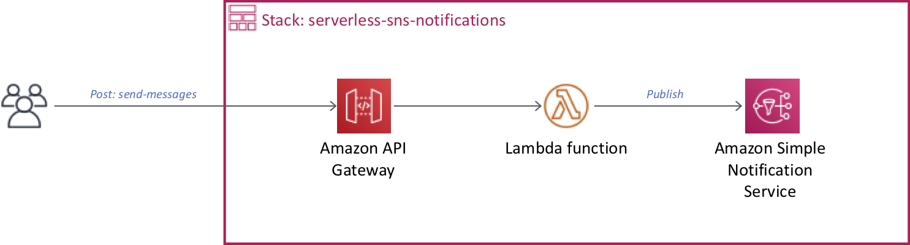
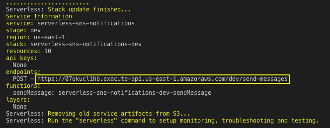

# Create a Serverless project to send notifications

Work inside your AWS Cloud9 or local environment.



## Configure your environment

``` bash
aws configure
```

- In AWS Cloud9 configure the AWS CLI as follows. 
    - AWS Access Key ID: **(Use default)**
    - AWS Secret Access Key: **(Use default)**
    - Default region name [us-east-1]: **us-east-1**
    - Default output format [json]: **json**
- In your local environment [configure the AWS CLI](https://docs.aws.amazon.com/cli/latest/userguide/cli-chap-configure.html#cli-quick-configuration) with your own IAM credentials.

## Install dependencies

Update Node.js to the minimal version of 8.

``` bash
nvm i v8
```

Install Serverless CLI tool https://serverless.com/framework/docs/providers/aws/guide/installation/

``` bash
npm install -g serverless
```

## Create a Serverless project

``` bash
serverless create --template aws-python --path serverless-textract
cd serverless-textract
```

Replace your **handler.py** with the contents of the file [handler.py](handler.py).

Replace your **serverless.yml** with the contents of the file [serverless.yml](serverless.yml).

## Deploy your Serverless project

``` bash
serverless deploy
```

Once the serverless project is deployed, copy the endpoint POST to test.



## Testing

Use (Postman)[https://www.getpostman.com/] to test your endpoint post and pass the following body json including a mobile number with area code.

``` json
{ "sms" : [ { "subject" : "Test", "message" : "This is a message!", "number": "5211234567890" }] }
```
